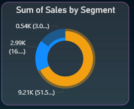

 📊 SuperStore Sales Analysis – Power BI Dashboard

## 🔍 Project Summary
This project presents an interactive Power BI dashboard built using the SuperStore Sales dataset.  
The dashboard helps analyze sales performance, profit trends, delivery efficiency, and customer behavior across different regions and product categories.

🔗 Live Power BI Report (View Online):
https://app.powerbi.com/groups/me/reports/8b4096ef-39be-4b0c-ba99-63eb1b8495eb/7bfc5ed4936bb6807756?experience=power-bi

> Note: Requires Power BI login using a work or college email ID.*

 🎯 Key Objectives
- 📈 Monitor overall **sales and profit performance**
- 🌍 Identify **top-performing regions and markets**
- 🛒 Analyze **product category and sub-category trends**
- 👥 Understand **customer segment behavior**
- 🚚 Measure **average delivery time** using Order and Ship dates

  📊 Dashboard Highlights
- ✅ KPI cards for:
  - Total Sales  
  - Total Profit  
  - Quantity Sold  
  - Average Delivery Time  
- 📍 Region-wise and market-wise sales analysis  
- 🧾 Category & Sub-Category performance comparison  
- 👤 Customer Segment distribution  
- 📅 Time-based trends using Order Date  
- 🎛 Interactive slicers for:
  - Region  
  - Category  
  - Segment  
  - Year / Date  

 🗂 Dataset Information
**Dataset Name:** SuperStore Sales Dataset  

Key Fields Used:
- Order Date, Ship Date  
- Region, Market  
- Customer Segment  
- Category, Sub-Category  
- Sales, Profit, Quantity, Discount  

The dataset represents historical retail transaction data used for business performance analysis.

 🛠 Tools & Technologies
- Power BI Desktop
- DAX for calculated measures
- Data Modeling
- CSV Dataset

 🧮 Key DAX Measures Used
- Total Sales  
- Total Profit  
- Profit Margin  
- Average Delivery Time  
- Year-over-Year Sales Analysis  

 📷 Dashboard Screenshots

 🔹 Overview Dashboard

 🔹 Sales by Region

 🔹 Profit Analysis

🚀 How to Use This Project
1. Download the `.pbix` file from the repository  
2. Open it using **Power BI Desktop**  
3. Use slicers and visuals to explore insights  
4. Refer to the PDF for quick preview  

 📌 Project Notes
- Public sharing via Power BI Service is restricted by organizational policy  
- The project is shared through:
  - `.pbix` file for interactivity  
  - `.pdf` export for easy viewing  

 📈 Business Insights Delivered
- Identified high-revenue regions and underperforming markets  
- Highlighted profitable product categories  
- Observed delivery delays impacting customer experience  
- Enabled data-driven decision making using interactive visuals  

