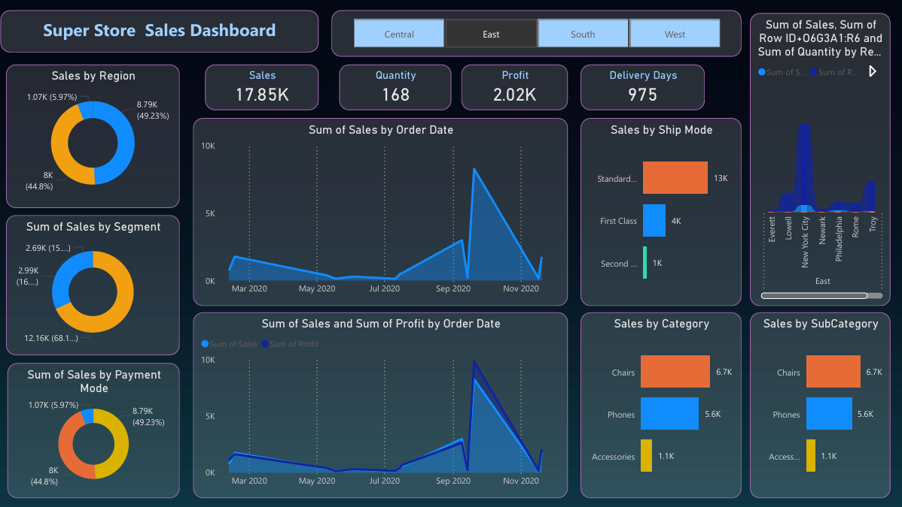
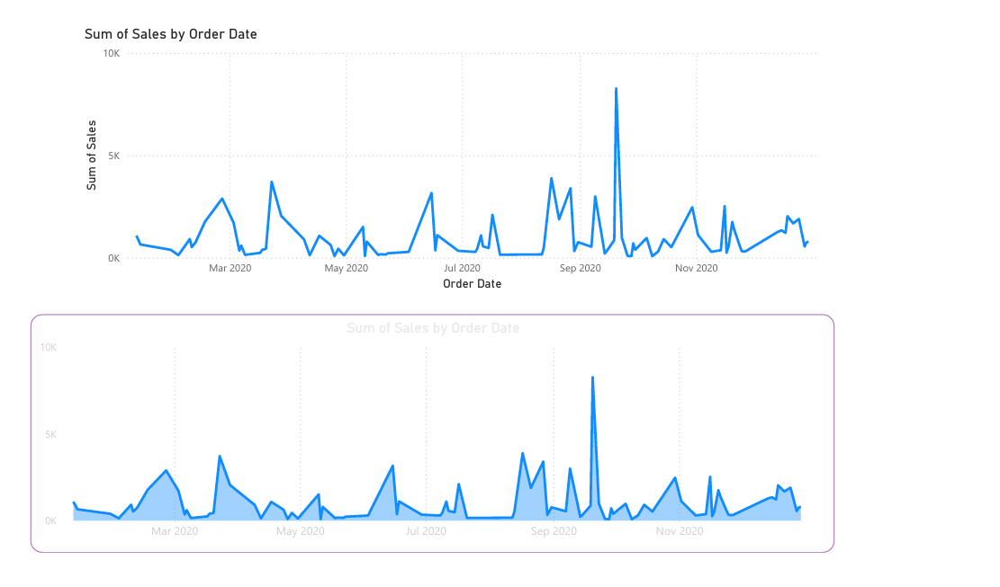
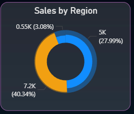
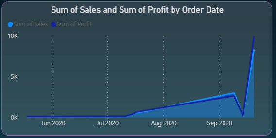
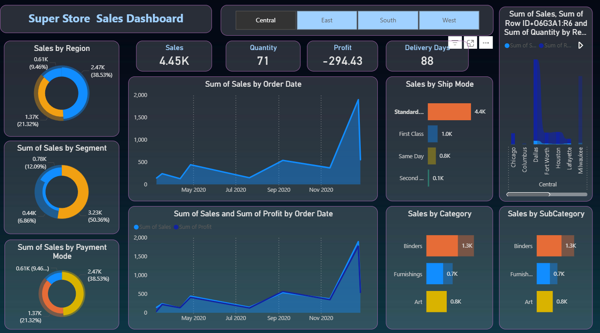
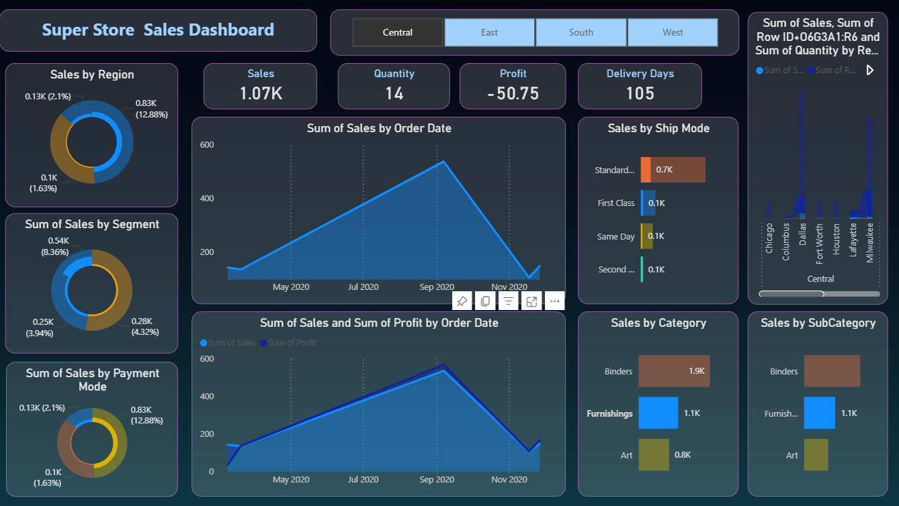
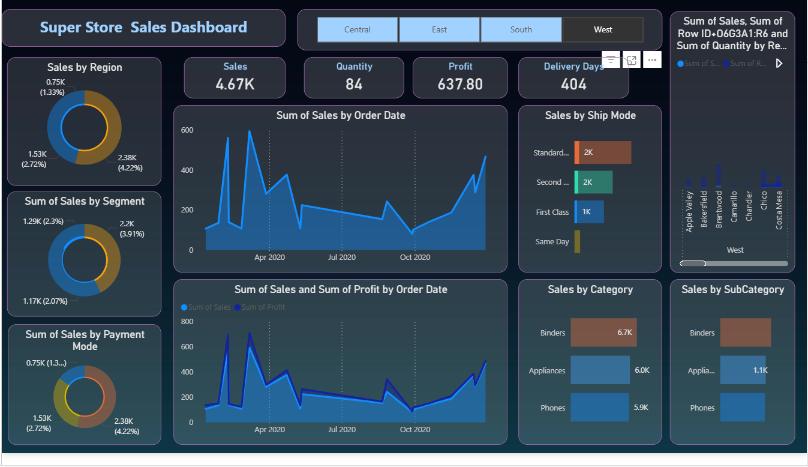

 # 📊 Super Store Sales Dashboard – Power BI

🔗 **Live Power BI Report (View Online):**  
https://app.powerbi.com/groups/me/reports/8b4096ef-39be-4b0c-ba99-63eb1b8495eb/7bfc5ed4936bb6807756?experience=power-bi  

> *Note: Requires Power BI login using a college or work Microsoft account.*

---

## 🔍 Project Overview
This project is an interactive **Power BI Sales Dashboard** built using the Super Store Sales dataset.  
It provides insights into sales performance, profitability, delivery efficiency, and customer behavior across multiple regions and product categories.

---

## 🎯 Objectives
- Analyze overall **sales and profit performance**
- Identify **high-performing regions and markets**
- Understand **customer segment contribution**
- Track **sales trends over time**
- Evaluate **delivery performance using shipping data**

---

## 📊 Dashboard Features
- KPI cards for:
  - Total Sales  
  - Total Quantity  
  - Total Profit  
  - Delivery Days  
- Region-wise sales distribution  
- Segment-wise and payment mode analysis  
- Sales and profit trend analysis over time  
- Category and sub-category performance  
- Interactive region slicers (Central, East, South, West)

---

## 🗂 Dataset Details
**Dataset:** Super Store Sales Dataset  

**Key Columns Used:**
- Order Date, Ship Date  
- Region, City  
- Segment, Payment Mode  
- Category, Sub-Category  
- Sales, Profit, Quantity  

---

## 🛠 Tools & Technologies
- Power BI Desktop  
- DAX  
- Data Modeling  
- CSV Dataset  

---

## 🧮 DAX Measures Implemented
- Total Sales  
- Total Profit  
- Quantity Sold  
- Average Delivery Days  
- Sales and Profit Trend Analysis  

---

## 📷 Dashboard Screenshots

### 🔹 Dashboard Overview

### 🔹 Sales Trend Over Time

### 🔹 Sales & Profit Trend

### 🔹 Sales by Region

### 🔹 Sales by Segment

### 🔹 Sales by Payment Mode

### 🔹 Sales by Ship Mode

### 🔹 Sales by Category

### 🔹 Sales by Sub-Category

---

## 🚀 How to Use
1. Download the `.pbix` file from this repository  
2. Open it using **Power BI Desktop**  
3. Use slicers and visuals to explore insights  
4. Refer to the PDF for quick preview  

---

## 📌 Notes
- Public sharing via Power BI Service is restricted by organization policy  
- Hence, the dashboard is shared using:
  - Power BI Service link (login required)
  - `.pbix` file
  - PDF export  

---

## 📈 Key Insights
- Identified top-performing regions and categories  
- Observed sales and profit fluctuations over time  
- Analyzed delivery efficiency using shipping data  
- Enabled data-driven business decision making  

---

## 👤 Author
**Rohit Naik**  
*For academic, internship, and portfolio purposes*

